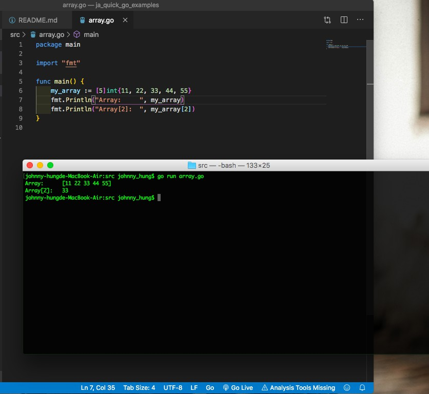
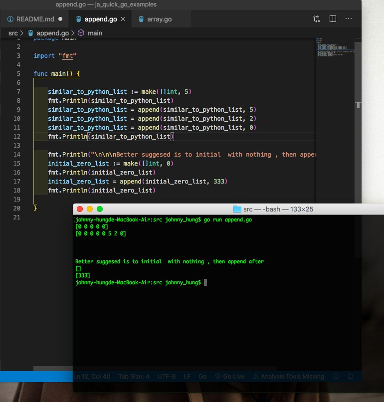
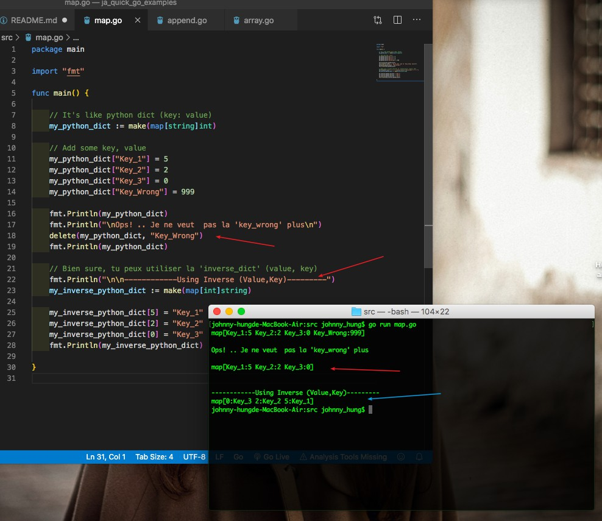
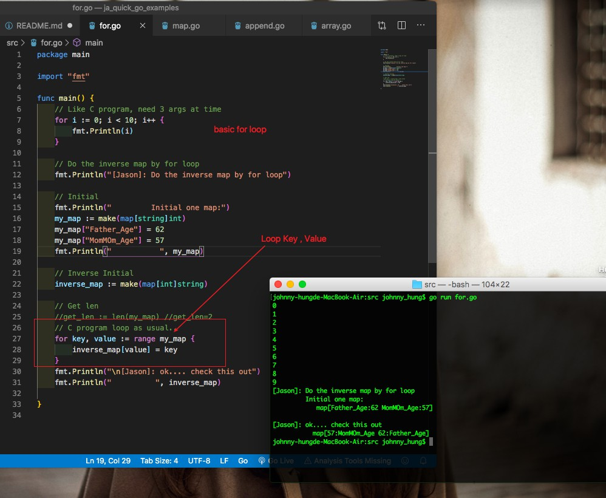
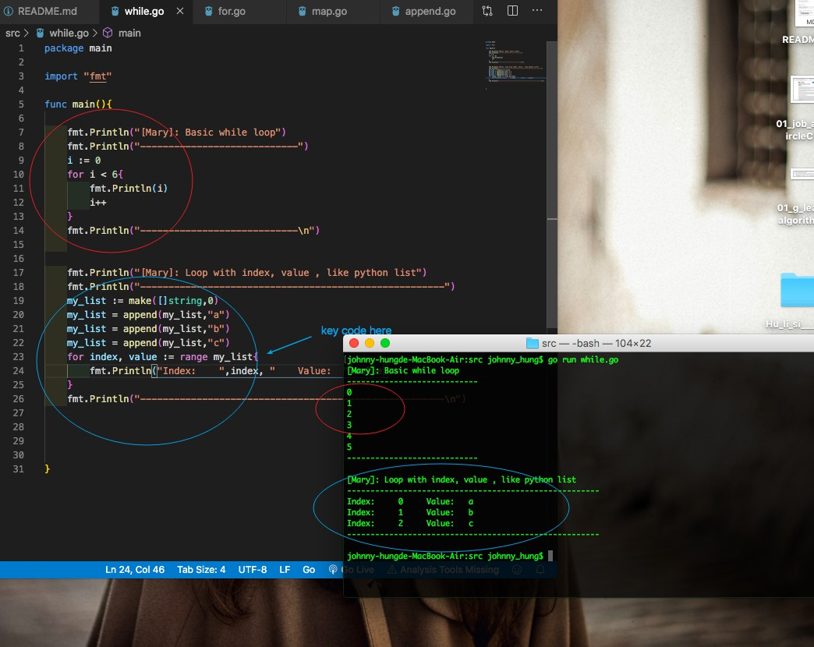

# Go examples

---

## Array

---

- variable := (another original way : var int)
- \[\] , indicate array
- import "fmt" package
- display array[3]
- display array
- Result:

---

## Append into Slice ( Python List)

---

- use python-like-list
- my_list := make(\[\]int, 5)
- my_list := append(my_list,999)
- suggested to initial with empy list []
  - my_empty_lis := make (\[\]int,0])
- Result:

---

---

## Map (Python Dict)

---

- See Code:
- check python_dict like map
- check python_inverse_dict like map

---

## Foor Loop (Similar to C program)

---

- Loop Original Way
- Loop Map for Key, Value

---

## While & Loop avec Index, Value

---

- check while loop
- check also for index, value in enumerate(python_list)

---

