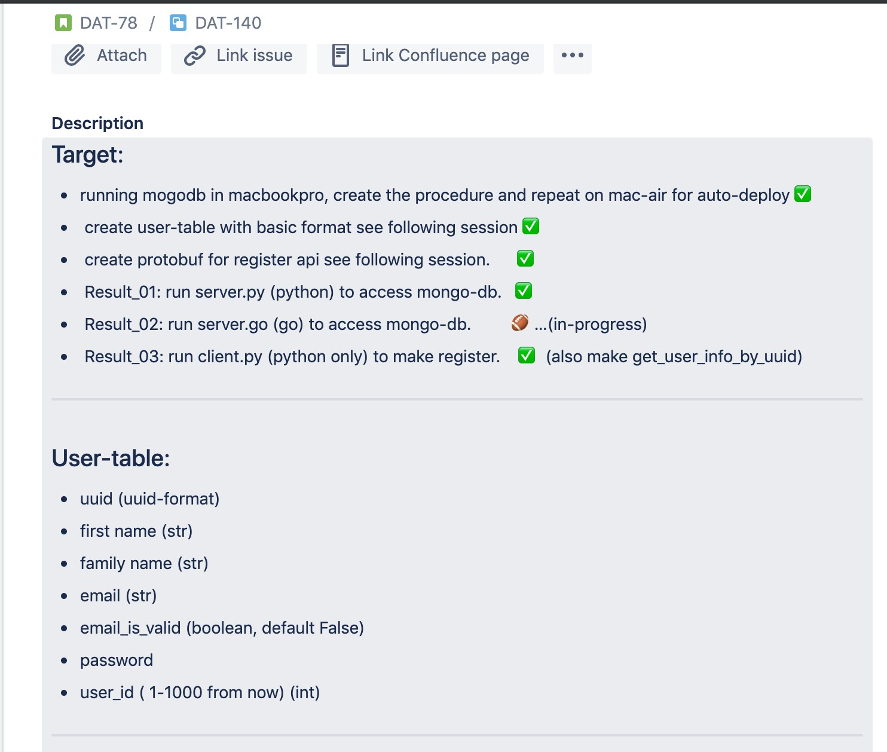

# grpc_backend
grpc, protobuf

## !! 😓..

---

Jean: Try use local host: 172.17.42.1

- access the code to gate-services , to call 172.17.41.1:5001
- then user_services shall be able to hear from gate

---

- source ja_create_mongodb.sh  (automation done)
    - create ja_mongodb folder
    - move mongod.conf to ja_mongodb folder

- source ja_run_db.sh        
    - run mongod with target_db

- type mongo start your table (not auto deploy yet)

---

## Status report:
---

