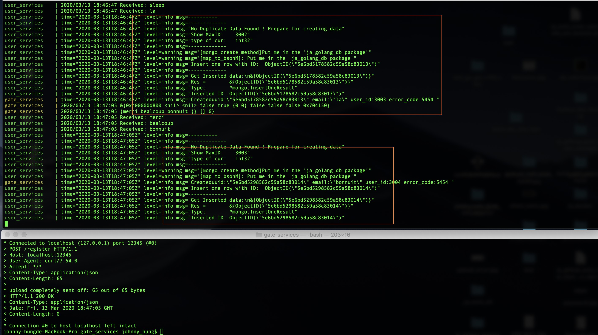

# grpc_backend
grpc, protobuf

## !! 😓..

---

Jean: Try use local host: 172.17.42.1

---

Finiah the docker-compose build and up for gate, user, mongodb
---
- docker-compose build
- docker-compose up
- check the docker-compose.yml file
- mongodb is mounting to ja_mongodb folder and working fine.

---

## Make the mongodb user_id as float64 as they want..
---

don't try to convert, it took too much time

---

- mongodb_user_id: float64
- grpc uer_id: int (for transfer , it's fine)

---

- source ja_create_mongodb.sh  (automation done)
    - create ja_mongodb folder
    - move mongod.conf to ja_mongodb folder

- source ja_run_db.sh        
    - run mongod with target_db

- type mongo start your table (not auto deploy yet)

---

## Status report:
---

=======
---

## File ls
---
- LICENSE
- README.md
- ja_cmd_history
- ja_git_push_back_v2.sh
    - used to auto push back for your current branch (save time purpose)
- ja_github_auto_creer_nouvelle_grpc_template_repo.sh
    - used to create new branch:
    - sop
        - put the ooo.sh to your path
        - source ooo.sh
        - type new_branch_name
        - this will automatically clone the master (basic file) to new_branch_name
    - I used this to seperate different branch with different type of tech. structure.

---
